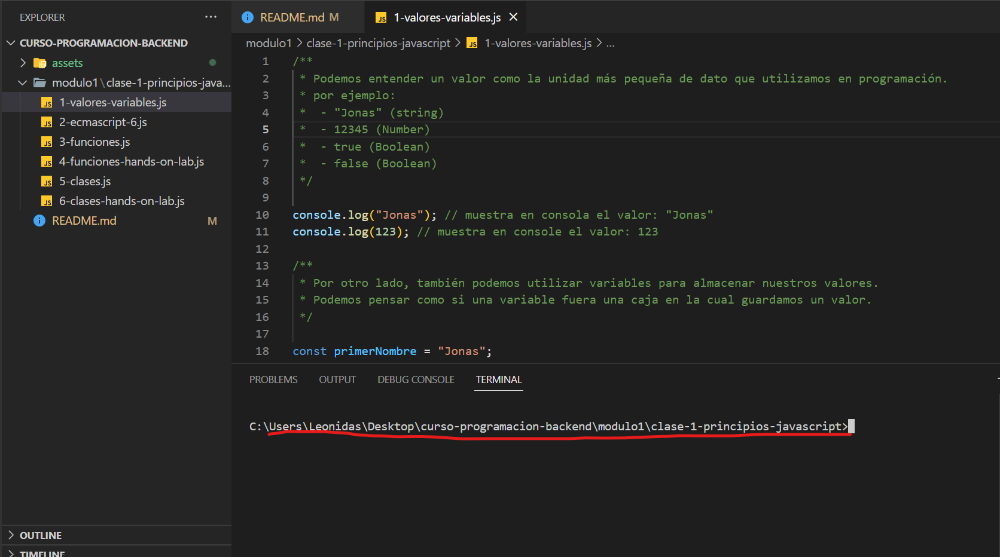
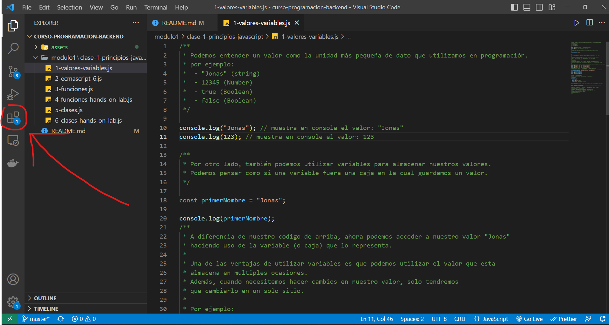
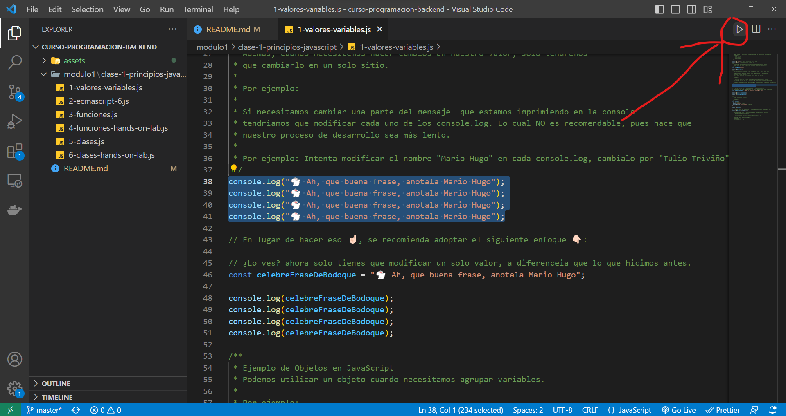

# Curso de Programacion Backend

## Bienvenidos a Nuestro Repo


### ✅ Para que este codigo pueda funcionar correctamente en tu equipo asegurate de tener estas herramientas instaladas:

- git. Por aquí te dejo un [video](https://www.youtube.com/watch?v=wHh3IgJvXcE) explicando como instalarlo y configurarlo
- node.js. Acá tienes el [link](https://nodejs.org/en/) para que lo descargues. Recuerda instalar la versión LTS
- Un editor de codigo, en este caso: VSCode. Acá tienes el [link](https://code.visualstudio.com/) para que lo descargues

### ✅ Ahora que ya tienes todo lo necesario, vamos a ejecutar nuestro codigo:

Hay dos maneras de ejecutar nuestro codigo:

- Usando el comando "node" en nuestra consola
- Usando la extensión "Code Runner" (recomendado)

#### 💻 Usando el comando "node"

1.  Abre la consola de tu preferencia (recomiendo que utilices la consola integrada al editor de codigo)
2.  Asegurate que el path o la ubicación en la que esta se encuentra abierta corresponda a la misma carpeta de la clase que quieres repasar. Por ejemplo: 
3.  Escribirmos el comando "node" en nuestra consola y seguido, indicamos el nombre del archivo que queremos ejecutar. De esta manera:

    ```
    node <nombre-archivo>

    // Por ejemplo: sí quieres ejecutar el archivo sobre valores y variables puedes hacer eso:
    node 1-valores-variables.js
    ```

> nota: al utilizar este comando, todo el codigo del archivo será ejecutado, lo cual no es muy conveniente en este caso porque en un mismo archivo podremos encontrar diferentes ejercicios de un mismo tema, obteniendo así un output bastante congestionado en nuestra consola.

#### 💻 Usando la extensión "Code Runner"

1. Entramos a nuestro VSCode y nos dirigimos al botón de extensiones que se encuentra en la barra lateral izquierda. Justo aquí: 
2. Escribimos en el buscador la extensión que necesitamos: "Code Runner". Esta extensión nos permitirá seleccionar qué codigo queremos ejecutar.
3. Una vez instalado, deberás seleccionar el tramo de codigo que deseas ejecutar y seguidamente hacer click en el botón play que podrás encontrar en la esquina superior derecha. De esta forma: 
4. Y voilá, ¡ya tienes un output mucho más limpio al que obtuvimos cuando usabamos el comando node!

## 🕺🏻💃🏻 Happy Coding!
